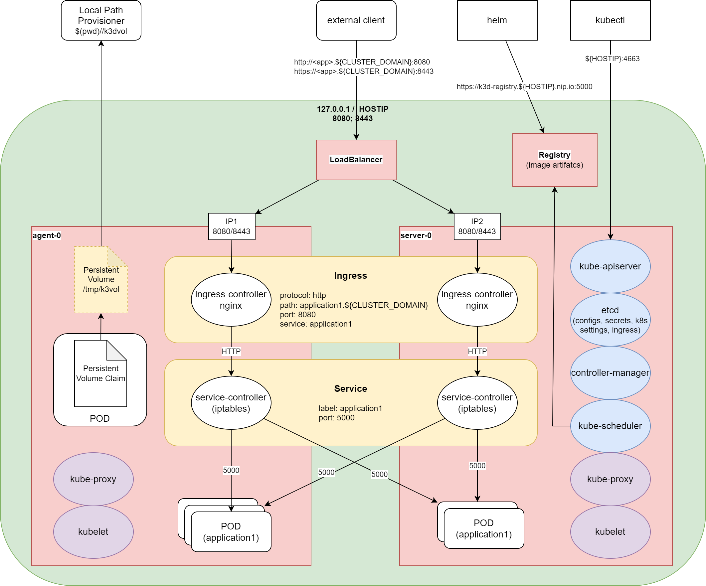

# Working with Local Kubernetes
_Hands-on Session_

---

# How It's Made

* **Container Management** (CRI -> container runtime)
* **Network Management** (CNI -> iptables, dns)
* **Volume Management** (CSI -> mounts)
* **Configuration Storge** (etcd, sql)

---

# What It's Made

* **kube-apiserver**
* **kube-scheduler**
* **kube-controll-manager**
* **kubelet**
* **kube-proxy**

---

---

# Minimal Valuable Cluster
_Functionalities for Convenience_

* **Nodes (server/agent/control-plane)**
* **Dashboard & Metrics**
* **Ingress**
* **Load Balancer / Tunnel**
* (Image Registry)
* (Cert Manager)

---

### ⚠️ Docker Knowledge Required ⚠️
_Training module expects understanding of Docker and containers_

---

# 1 - Minikube
_[https://minikube.sigs.k8s.io/](https://minikube.sigs.k8s.io/)_

* **Developed by Google**
* **CNCF certified**
* **Multi-node-cluster** - `minikube start -p <name>`
* **LoadBalancer** - `minikube tunnel`
* **Persistent Volumes**
* **Ingress**
* **Container runtime** - Docker,containerd,CRI-O
* **Networking** - Calico,Flannel

---

# 💻 Demo 💻 #

---

# 2 - MicroK8s
_[https://microk8s.io/](https://microk8s.io/)_

* **Developed by Canonical**
* **CNCF certified**
* **Multi-node-cluster**
* **Persistent Volumes**
* **Ingress**
* **Container runtime** - containerd,kata
* **Networking** - Calico
* **Based on [Multipass](https://multipass.run/docs)**

---

# 💻 Demo 💻 #

---

# 3 - K3D
__[https://k3d.io/](https://k3d.io/)__

* **Developed by Rancher**
* **CNCF certified**
* **Multi-node-cluster**
* **LoadBalancer**
* **Persistent Volumes**
* **Ingress**
* **Container runtime** - CRI-O
* **Networking** - Flannel,Canal

---

# 💻 Demo 💻 #

---

# 4 - k0s
_[https://k0sproject.io/](https://k0sproject.io/)_

* **Developed by Team Lens**
* **CNCF certified**
* **Multi-node-cluster**
* **Persistent Volumes**
* **Ingress**
* **Container runtime** - containerd
* **Networking** - Kube-Router,Calico

---

# 💻 Demo 💻 #

---

# 5 - Docker Desktop

* **Developed by Docker Inc.**
* **CNCF certified**
* **Single-node-cluster** - k8s
* **Persistent Volumes**
* **Ingress**
* **Container runtime** - dockerd
* **Networking** - vpnkit

---

# 💻 Demo 💻 #

---

# 6 - Rancher Desktop

* **Developed by Rancher Inc.**
* **CNCF certified**
* **Single-node-cluster** - k3s
* **Persistent Volumes**
* **Ingress** - Traefik
* **Container runtime** - containerd,dockerd(moby)
* **Networking** - Flannel,Calico,Canal

---

# 💻 Demo 💻 #

---

# 7 - KIND

* **Developed by Google**
* **CNCF certified**

---

# 💻 Demo 💻 #

---

# 8 - vCluster
_[https://www.vcluster.com/](https://www.vcluster.com/)_

* **Developed by Loft Labs**
* **CNCF certified**

---

# 💻 Demo 💻 #

---

# ❓ Q&A ❓ #

---
