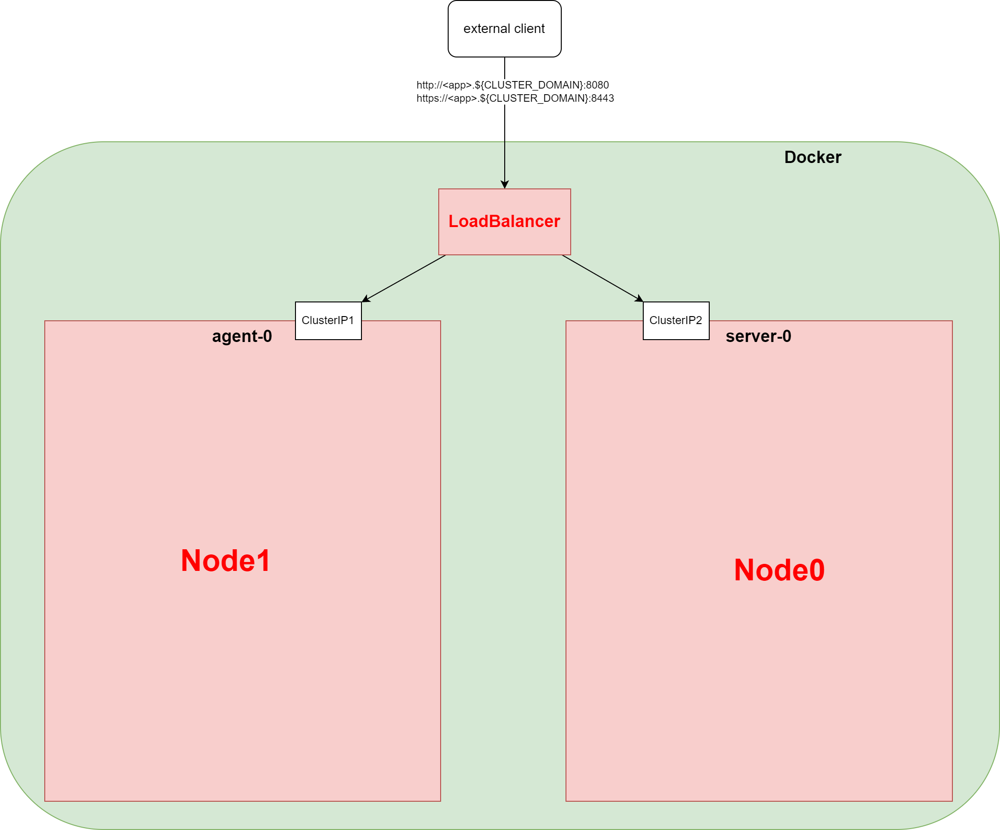
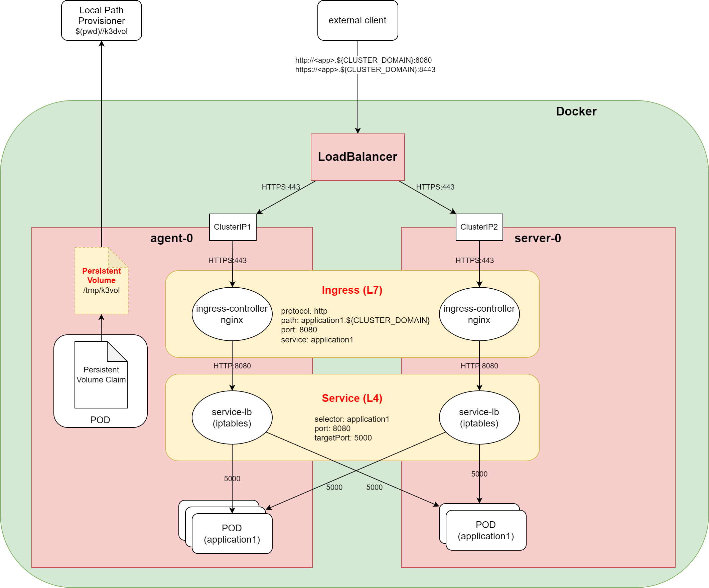
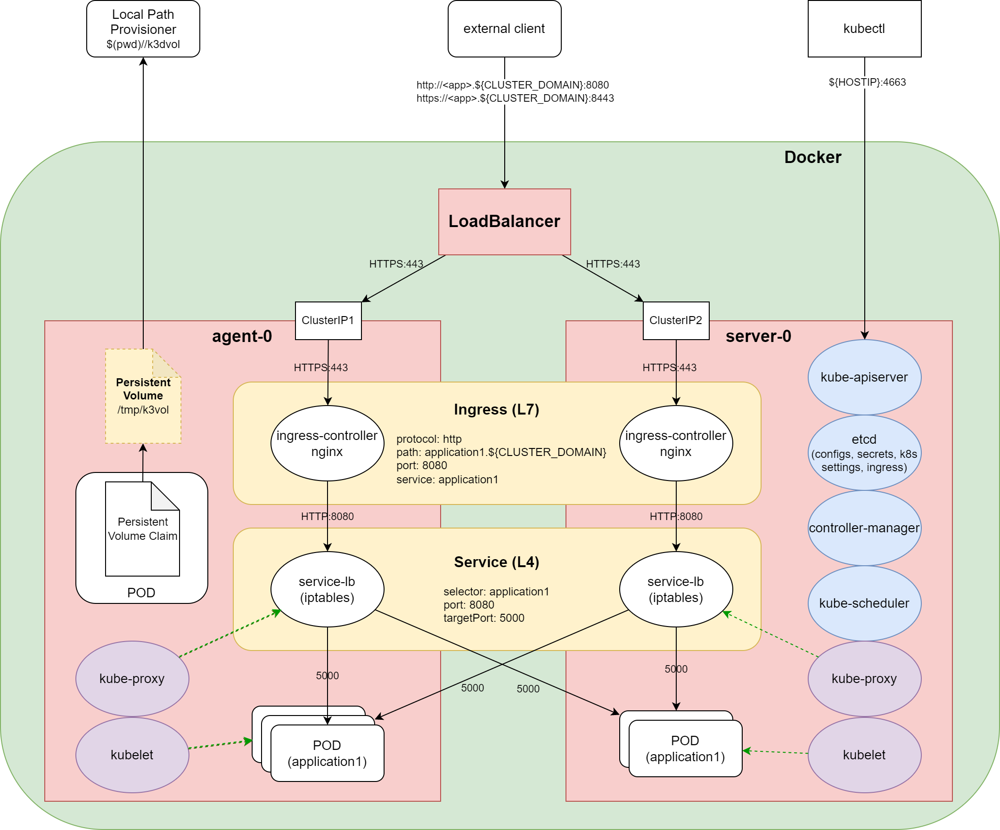

# Working with Local Kubernetes
_Hands-on Session_

---

# How It's Made
_Cloud Native Computing Foundation_

* **Container Management** (CRI -> container runtime)
* **Network Management** (CNI -> iptables, dns)
* **Volume Management** (CSI -> mounts)
* **Configuration Storge** (etcd, sql)

---

# What It's Made

* **kube-apiserver** - handels requests
* **kube-scheduler** - finds place to pods
* **kube-controller-manager** - manages controllers
* **kubelet** - creates/destroys pods
* **kube-proxy** - maintains the network

---

<!-- .slide: data-transition="convex-in none-out" -->

---

<!-- .slide: data-transition="fade-in none-out" -->

---

<!-- .slide: data-transition="fade-in convex-out" -->

---

# Minimal Valuable Cluster
_Use Case: Local Testing and Development_

* **Nodes (server/agent/control-plane)**
* **Load Balancer / Tunnel**
* **Ingress**
* **Cert Manager**
* **Dashboard & Metrics**
* (Image Registry)

---

## ⚠️ Docker Knowledge Required ⚠️
#### Training module expects understanding of Docker and containers

1. **Minikube**
2. **Docker-Desktop**
3. **Rancher-Desktop**
4. **MicroK8s**
5. **KIND**
6. **K3D**
7. **K0S**
8. **vCluster**

---

# 1 - Minikube
_[https://minikube.sigs.k8s.io/](https://minikube.sigs.k8s.io/)_

* **Developed by Google**
* **CNCF certified**
* **Multi-node-cluster** - `minikube start -p <name>`
* **LoadBalancer** - `minikube tunnel`
* **Container runtime** - Docker Engine,containerd,CRI-O
* **Networking** - Calico,Flannel

---

# 2 - Docker Desktop
_[https://www.docker.com/products/docker-desktop/](https://www.docker.com/products/docker-desktop/)_

* **Developed by Docker Inc.**
* **CNCF certified**
* **Single-node-cluster** - k8s
* **Container runtime** - dockerd
* **Networking** - vpnkit
* **Dashboard** - good enough

---

# 3 - Rancher Desktop
_[https://rancherdesktop.io/](https://rancherdesktop.io/)_

* **Developed by SUSE**
* **CNCF certified**
* **Single-node-cluster** - K3s
* **Container runtime** - containerd,dockerd(moby)
* **Networking** - Flannel,Calico,Canal
* **Dashboard** - decent

---

# 4 - MicroK8s
_[https://microk8s.io/](https://microk8s.io/)_

* **Developed by Canonical**
* **CNCF certified**
* **Multi-node-cluster** - `microk8s add-node`, then start new VM
* **Container runtime** - containerd,kata
* **Networking** - Calico
* **Based on [Multipass](https://multipass.run/docs)**

---

# 5 - KIND
_[https://kind.sigs.k8s.io/](https://kind.sigs.k8s.io/)_

* **Developed by Google**
* **CNCF certified**
* **Multi-node-cluster** - automatic
* **Container runtime** - dockerd
* **Networking** - kindnet ([ptp](https://www.cni.dev/plugins/current/main/ptp/) plugin for CNI)

---

# 6 - K3D
__[https://k3d.io/](https://k3d.io/)__

* **Developed by SUSE**
* **CNCF certified**
* **Multi-node-cluster** - automatic
* **LoadBalancer** - dedicated
* **Container runtime** - CRI-O
* **Networking** - Flannel,Canal

---

# 7 - k0s
_[https://k0sproject.io/](https://k0sproject.io/)_

* **Developed by Team Lens**
* **CNCF certified**
* **Multi-node-cluster** - worker/master token
* **Container runtime** - containerd
* **Networking** - Kube-Router,Calico
* **One single binary** - statically linked, no OS-level dependencies

---

# 8 - vCluster
_[https://www.vcluster.com/](https://www.vcluster.com/)_

* **Developed by Loft Labs**
* **CNCF certified**
* **Multi-node-cluster** - real/fake

---

# Summary
_06/01/2022_

|               | Default | OS Image       | Container Runtime | Memory        |
|---------------|----------|----------------|-------------------|---------------|
| **Minikube**  | v1.23.3  | Ubuntu 20.04.2 | docker://20.10.12 |  1G + 300M    |
| **Docker D**  | v1.24.0  | Alpine v3.15   | docker://20.10.14 |  2 GB      |
| **Rancher D** | v1.23.6  |                | containerd://1.5.11 |  2 GB      |
| **MicroK8S**  | v1.24.0  |   ---          | containerd://1.5.11 |        |
| **KIND**      | v1.24.0  | Ubuntu 21.10   | containerd://1.6.4  |  1G + 200M     |
| **K3D**       | v1.21.12 | Alpine v3.16   | containerd://1.4.13 |  800M + 200M   |
| **K0S**       | v1.23.6  | Alpine v3.13   | containerd://1.5.11 |  1.3G + 256M   |

---

# 👍 _Thank You_ 👍

**repo:** [https://github.com/psaghelyi/local-kubernetes](https://github.com/psaghelyi/local-kubernetes)

**presentation:** [https://revealjs.com/markdown/](https://revealjs.com/markdown/)

**drawings:** [https://drawio-app.com/](https://drawio-app.com/)

